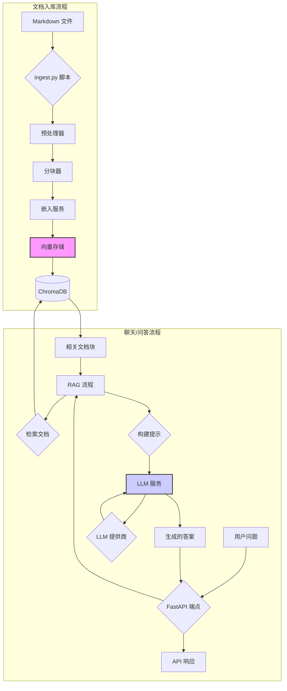

# AI 服务项目架构

本文档详细概述了 AI 服务的架构、组件和工作流程。

## 1. 概述

AI 服务是一个基于 Python 的应用程序，旨在为文档语料库提供智能问答功能。它利用 **检索增强生成 (RAG)** 架构，将语义搜索与大型语言模型 (LLM) 相结合，以生成准确且具有上下文感知能力的答案。

该系统采用模块化和面向服务的设计，使其易于扩展和维护。它被打包成一个 **FastAPI** Web 服务，并可以使用 **Docker** 进行部署。

## 2. 技术栈

该项目依赖于以下关键技术和库：

- **后端框架**: `FastAPI`
- **Web 服务器**: `Uvicorn`
- **向量数据库**: `ChromaDB`
- **LLM 集成**: `OpenAI SDK`, `HTTPX` (用于自定义集成)
- **嵌入模型**: `Sentence-Transformers`
- **配置管理**: `Pydantic-Settings`
- **数据处理**: `Pydantic`, `Markdown`, `BeautifulSoup4`
- **日志记录**: `Loguru`
- **依赖管理**: `Poetry`

## 3. 架构图

该系统由两个主要工作流程组成：**文档入库** 和 **聊天/问答**。

## 4. 核心组件

该项目由几个关键目录和模块构成：

### `src/` - 主要应用代码

-   **`main.py`**: FastAPI 应用程序的入口点。它定义了 API 端点、中间件、异常处理和应用程序生命周期事件 (启动/关闭)。

-   **`config/settings.py`**: 使用 `Pydantic-Settings` 管理所有应用程序配置。它从环境变量和 `.env` 文件中加载设置，提供了一种集中且类型安全的方式来配置应用程序。

-   **`models/`**: 包含用于数据结构的 Pydantic 模型。
    -   `chat.py`: 定义 `/chat` 端点的 API 请求和响应模型 (例如 `ChatRequest`, `ChatResponse`)。
    -   `document.py`: 定义用于文档处理的模型，如 `DocumentChunk` 和 `ProcessedDocument`。

-   **`services/`**: 应用程序的核心逻辑封装在服务中。
    -   **`embedding.py`**: 负责使用 `sentence-transformers` 模型从文本生成向量嵌入。
    -   **`vector_store.py`**: 管理与 ChromaDB 向量数据库的所有交互。它处理添加、搜索和删除文档向量。
    -   **`llm.py`**: 一个用于与各种 LLM 提供商 (如 OpenAI, 阿里云, DeepSeek) 通信的抽象层。它处理 API 请求并标准化响应格式。
    -   **`rag.py`**: 实现主要的 RAG 流程。它协调从向量存储中检索相关文档、构建带有上下文的提示以及调用 LLM 服务生成答案的过程。

-   **`utils/`**: 包含用于数据处理的实用工具函数。
    -   **`preprocessing.py`**: 在处理 Markdown 文件之前对其进行清理并提取元数据。
    -   **`chunking.py`**: 将大文档分割成更小、具有语义意义的块，以便于有效检索。

### `scripts/` - 操作脚本

-   **`ingest.py`**: 一个命令行脚本，用于处理文档文件。它从指定目录读取 Markdown 文件，对其进行预处理、分块，并将生成的向量存储在 ChromaDB 中。
-   **`test_service.py`**: 用于测试服务端点的简单脚本。

### `data/`

-   **`chroma_db/`**: ChromaDB 持久化其向量数据库文件的默认目录。

## 5. 工作流程

### 5.1. 文档入库工作流程

入库流程负责填充向量数据库。

1.  **触发**: 手动或通过自动化流程执行 `scripts/ingest.py` 脚本。
2.  **文件发现**: 脚本扫描配置的文档目录以查找 Markdown (`.md`) 文件。
3.  **预处理**: 读取每个文件，并由 `default_preprocessor` 清理其内容。此步骤可能包括删除不必要的 HTML 标签或提取 frontmatter 元数据。
4.  **分块**: 清理后的内容被传递给 `default_chunker`，后者根据配置的大小和重叠将文本分割成更小的 `DocumentChunk` 对象。
5.  **嵌入**: 每个块的内容由 `embedding_service` 转换为数值向量。
6.  **存储**: 这些块及其向量嵌入和元数据通过 `vector_store` 服务存储在 ChromaDB 集合中。

### 5.2. 聊天/问答工作流程

此工作流程处理用户查询并生成答案。

1.  **API 请求**: 用户向 FastAPI 应用程序的 `/api/chat` 端点发送一个问题。
2.  **RAG 流程调用**: 端点调用 `rag_pipeline` 来处理请求。
3.  **文档检索**: RAG 流程接收用户的问题并为其创建向量嵌入。然后，它查询 `vector_store` 以查找最相似的文档块 (即最相关的上下文)。
4.  **提示构建**: 将检索到的块格式化为上下文块。此上下文连同用户的问题和任何对话历史一起被插入到系统提示模板中。
5.  **LLM 生成**: 最终的提示被发送到配置的 `llm_service`。LLM 根据提供的上下文和问题生成答案。
6.  **API 响应**: 生成的答案连同从检索到的文档中提取的来源参考一起被格式化为 `ChatResponse` 并发送回给用户。

## 6. 配置

-   **环境变量**: 所有配置都通过环境变量进行管理，并支持 `python-dotenv` 以便在本地开发中使用 `.env` 文件。
-   **`performance_config.py`**: 一个可选文件，可通过在运行时覆盖默认环境变量来应用优化设置。这使得在标准模式和高性能模式之间轻松切换成为可能。
-   **集中式设置**: `src/config/settings.py` 文件为整个应用程序中使用的所有配置值提供了唯一的真实来源。
