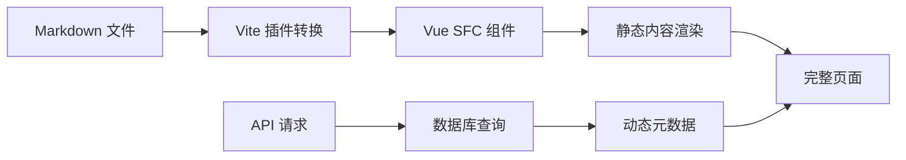

# 📖 VitePress-Lite 前端文档站点

> 基于 Vue 3 + Vite 的现代化文档站点，通过自定义插件实现 Markdown 到 Vue SFC 的实时转换

## 🎯 核心理念

本项目实现了一个**混合渲染架构**，将文件系统的版本管理优势与数据库的动态功能完美结合：

- **静态内容**：Markdown 文件通过 Vite 插件实时转换为 Vue 组件
- **动态元数据**：作者信息、发布状态等通过 API 从数据库获取
- **开发体验**：支持 HMR 热更新，文档修改立即可见

## 🔌 自定义 Vite 插件系统

### 1. Markdown 转换插件 (`markdown-transformer-plugin.js`)

**核心功能**：将 `.md` 文件转换为 Vue 单文件组件

```javascript
// 工作流程
.md 文件 → gray-matter 解析 → markdown-it 渲染 → Vue SFC 模板 → 热更新
```

**关键特性**：

- **Frontmatter 解析**：提取文章元数据（标题、作者、日期等）
- **自动注入组件**：每个页面自动包含 `GlobalNav` 导航组件
- **HMR 支持**：文件修改时触发 WebSocket 事件，实现热更新
- **插件扩展**：支持 markdown-it 插件，如 `markdown-it-anchor` 生成锚点

**配置示例**：

```javascript
markdownTransformerPlugin({
  markdownItOptions: {
    html: true, // 允许 HTML 标签
    linkify: true, // 自动链接化 URL
  },
  markdownItPlugins: [
    [
      markdownItAnchor,
      {
        permalink: true,
        permalinkSymbol: "#",
      },
    ],
  ],
});
```

### 2. 虚拟页面插件 (`virtual-pages-plugin.js`)

**核心功能**：自动扫描 `docs/` 目录，生成虚拟路由模块

```javascript
// 生成的虚拟模块：virtual:pages
export const routes = [
  { path: "/unit/unit1", component: () => import("virtual:md:unit/unit1.md") },
  { path: "/unit/unit2", component: () => import("virtual:md:unit/unit2.md") },
  // ...更多路由
];
```

**智能路径映射**：

```
文件路径                   → 路由路径
docs/total.md             → /total
docs/unit/unit1.md        → /unit/unit1
docs/advanced/概念.md      → /advanced/概念
```

**动态导入优化**：每个页面按需加载，提升初始加载性能

## 🏗️ 混合渲染架构

### 页面渲染流程



### 数据获取策略

**静态数据**（来自文件）：

- Markdown 内容主体
- Frontmatter 基础信息
- 实时 HMR 更新

**动态数据**（来自 API）：

- 作者详细信息（头像、邮箱）
- 精确的创建/更新时间
- 发布状态和文章统计
- 用户相关的个性化数据

### 优雅降级机制

```typescript
// 示例：组合静态和动态数据
const pageData = {
  // 静态数据（总是可用）
  title: frontmatter.title,
  content: markdownContent,

  // 动态数据（可能失败）
  author: await fetchAuthor(frontmatter.author).catch(() => null),
  publishedAt: await fetchPublishTime(slug).catch(() => frontmatter.date),
};
```

当 API 失败时，页面仍能正常显示静态内容，保证基本功能不受影响。

## 🧩 组件系统架构

### 核心组件

**`GlobalNav.vue`** - 全局导航组件

- 自动扫描所有可用页面
- 支持嵌套路由显示
- 当前页面高亮
- 响应式折叠菜单

**`MarkdownList.vue`** - 文档列表组件

- 展示文档集合
- 支持过滤和搜索
- 卡片式布局

**`MarkdownCard.vue`** - 文档卡片组件

- 显示文档摘要信息
- 支持标签和元数据展示
- 链接到详细页面

### 状态管理

使用 Vue 3 的组合式 API 和 Pinia：

```typescript
// composables/usePostsData.ts
export const usePostsData = () => {
  const posts = ref([]);
  const loading = ref(false);

  const fetchPosts = async () => {
    // 混合数据获取逻辑
  };

  return { posts, loading, fetchPosts };
};
```

## 🛠️ 开发工作流

### 本地开发

```bash
# 启动开发服务器
pnpm dev

# 访问应用
http://localhost:5173
```

**开发时的完整流程**：

1. **编辑 Markdown**：在 `docs/` 目录下修改 `.md` 文件
2. **实时预览**：Vite HMR 自动更新页面内容
3. **同步数据库**：运行 `pnpm db:sync` 同步元数据
4. **查看效果**：刷新页面看到静态+动态的完整渲染

### 添加新文档

1. 在 `docs/` 下创建 `.md` 文件：

```markdown
---
title: "新文档标题"
author: "作者邮箱"
date: "2025-01-01"
published: true
---

# 文档内容

这里是你的 Markdown 内容...
```

2. 文件保存后自动生成路由
3. 在导航中可见新页面
4. 运行同步命令更新数据库

### 自定义主题

**全局样式**：修改 `src/style.css`

```css
:root {
  --primary-color: #42b983; /* 主题色 */
  --bg-color: #ffffff; /* 背景色 */
  --text-color: #2c3e50; /* 文字色 */
}
```

**组件样式**：使用 Scoped CSS

```vue
<style scoped>
.markdown-content {
  max-width: 800px;
  margin: 0 auto;
  line-height: 1.7;
}
</style>
```

## ⚙️ 配置说明

### Vite 配置 (`vite.config.ts`)

```typescript
export default defineConfig({
  plugins: [
    inspect(), // 调试工具
    markdownTransformerPlugin(), // MD 转换
    vue({ include: [/\.vue$/, /\.md$/] }),
    virtualPagesPlugin(), // 虚拟路由
  ],
  server: {
    port: 5173,
    proxy: {
      "/api": "http://localhost:3001", // API 代理
    },
  },
});
```

### 路由配置 (`src/router/index.ts`)

- 静态路由：手动定义的特殊页面
- 动态路由：通过虚拟模块自动生成
- 404 处理：未匹配路由的降级页面

## 🔍 调试与优化

### 开发工具

- **Vite Inspector**：可视化模块依赖图
- **Vue DevTools**：组件状态调试
- **Network Tab**：API 请求监控

### 性能优化

- **路由懒加载**：每个页面按需加载
- **组件缓存**：使用 `keep-alive` 缓存页面状态
- **API 缓存**：避免重复的数据库查询
- **静态资源优化**：Vite 自动进行代码分割

## 🚀 扩展指南

### 添加新的 Markdown 插件

```javascript
// vite.config.ts
markdownTransformerPlugin({
  markdownItPlugins: [
    [require("markdown-it-katex")], // 数学公式
    [require("markdown-it-footnote")], // 脚注
    [require("markdown-it-container")], // 自定义容器
  ],
});
```

### 自定义页面类型

1. 在 `src/pages/` 添加新组件
2. 在路由配置中注册
3. 更新导航逻辑以支持新页面

### 国际化支持

项目结构已为国际化做好准备：

```
docs/
├── zh/           # 中文文档
├── en/           # 英文文档
└── shared/       # 共享资源
```

## 📦 构建与部署

### 构建生产版本

```bash
# 类型检查 + 构建
pnpm build

# 预览构建结果
pnpm preview
```

### 部署配置

生成的 `dist/` 目录包含所有静态资源，可部署到任何静态托管服务：

- **Netlify/Vercel**：零配置部署
- **GitHub Pages**：通过 Actions 自动部署
- **CDN**：配合 API 服务器的混合部署

---

## 🔗 相关链接

- **后端 API 文档**：[../api-server/README.md](../api-server/README.md)
- **项目总览**：[../../README.md](../../README.md)
- **Vue 3 文档**：https://vuejs.org/
- **Vite 插件开发**：https://vitejs.dev/guide/api-plugin.html
